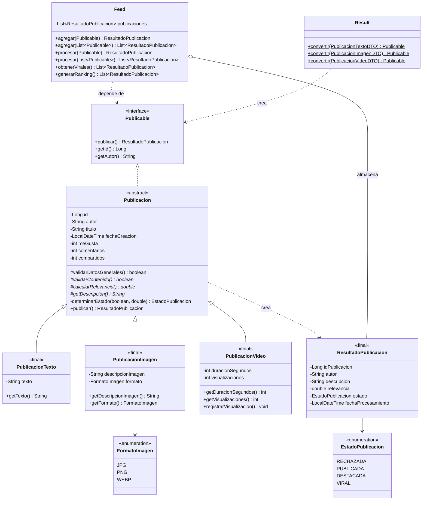
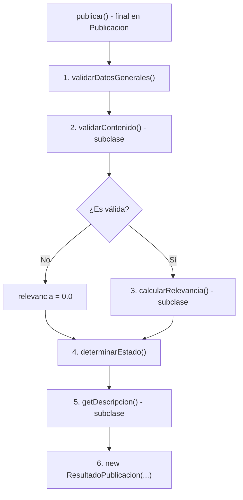

## 3. Diagrama de clases

```mermaid
classDiagram
    direction TB

    class Publicable {
        <<interface>>
        +publicar() ResultadoPublicacion
        +getId() Long
        +getAutor() String
    }

    class Publicacion {
        <<abstract>>
        -Long id
        -String autor
        -String titulo
        -LocalDateTime fechaCreacion
        -int meGusta
        -int comentarios
        -int compartidos
        #validarDatosGenerales() boolean
        #validarContenido()* boolean
        #calcularRelevancia()* double
        #getDescripcion()* String
        -determinarEstado(boolean, double) EstadoPublicacion
        +publicar() ResultadoPublicacion
    }

    class PublicacionTexto {
        <<final>>
        -String texto
        +getTexto() String
    }

    class PublicacionImagen {
        <<final>>
        -String descripcionImagen
        -FormatoImagen formato
        +getDescripcionImagen() String
        +getFormato() FormatoImagen
    }

    class PublicacionVideo {
        <<final>>
        -int duracionSegundos
        -int visualizaciones
        +getDuracionSegundos() int
        +getVisualizaciones() int
        +registrarVisualizacion() void
    }

    class ResultadoPublicacion {
        <<final>>
        -Long idPublicacion
        -String autor
        -String descripcion
        -double relevancia
        -EstadoPublicacion estado
        -LocalDateTime fechaProcesamiento
    }

    class FormatoImagen {
        <<enumeration>>
        JPG
        PNG
        WEBP
    }

    class EstadoPublicacion {
        <<enumeration>>
        RECHAZADA
        PUBLICADA
        DESTACADA
        VIRAL
    }

    class Feed {
        -List~ResultadoPublicacion~ publicaciones
        +agregar(Publicable) ResultadoPublicacion
        +agregar(List~Publicable~) List~ResultadoPublicacion~
        +procesar(Publicable) ResultadoPublicacion
        +procesar(List~Publicable~) List~ResultadoPublicacion~
        +obtenerVirales() List~ResultadoPublicacion~
        +generarRanking() List~ResultadoPublicacion~
    }

    class Result {
        +convertir(PublicacionTextoDTO)$ Publicable
        +convertir(PublicacionImagenDTO)$ Publicable
        +convertir(PublicacionVideoDTO)$ Publicable
    }

    Publicable <|.. Publicacion
    Publicacion <|-- PublicacionTexto
    Publicacion <|-- PublicacionImagen
    Publicacion <|-- PublicacionVideo
    PublicacionImagen --> FormatoImagen
    ResultadoPublicacion --> EstadoPublicacion
    Publicacion ..> ResultadoPublicacion : crea
    Feed ..> Publicable : depende de
    Feed o-- ResultadoPublicacion : almacena
    Result ..> Publicable : crea
```

### Flujo del método plantilla `publicar()`

```mermaid
flowchart TD
    A["publicar() - final en Publicacion"] --> B["1. validarDatosGenerales()"]
    B --> C["2. validarContenido() - subclase"]
    C --> D{"¿Es válida?"}
    D -- No --> E["relevancia = 0.0"]
    D -- Sí --> F["3. calcularRelevancia() - subclase"]
    E --> G["4. determinarEstado()"]
    F --> G
    G --> H["5. getDescripcion() - subclase"]
    H --> I["6. new ResultadoPublicacion(...)"]
```

---

